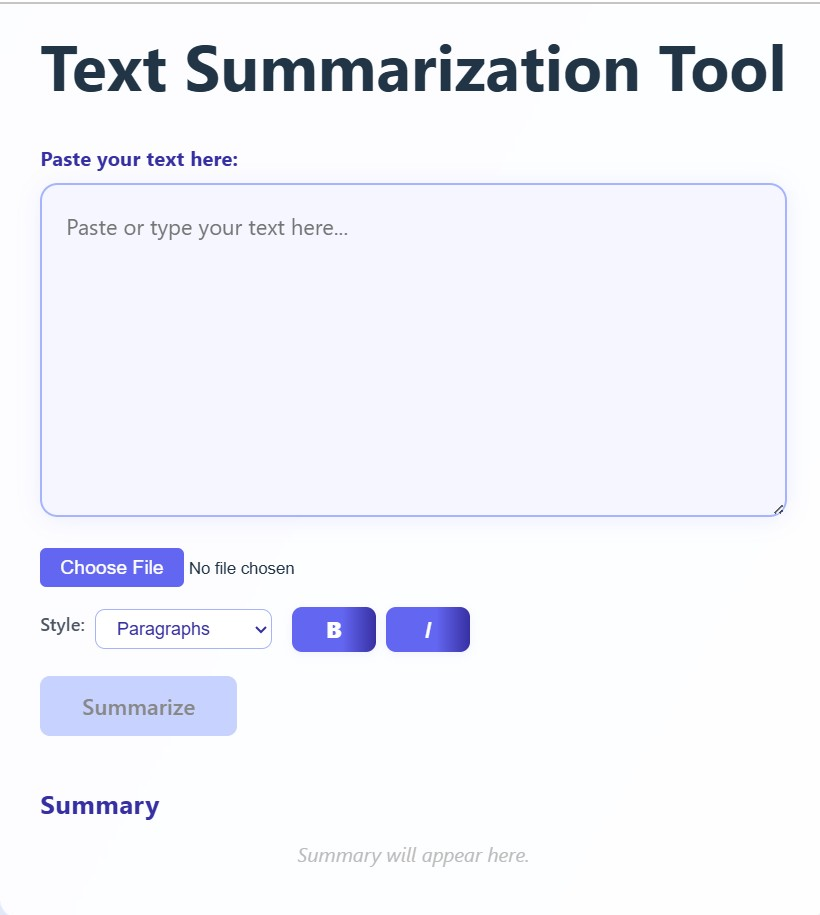

# 📄 Text Summarization Tool

A web application to quickly summarize large blocks of text into meaningful content such as **paragraphs**, **bullet points**, or **numbered lists**. Built with **React (frontend)** and **FastAPI (backend)**, this tool uses **TF-IDF** and **NLTK** to extract key insights from raw text.

---

## 🖼️ Screenshot




---

## 🚀 Features

- ✅ Upload `.txt` file or paste raw text.
- ✅ Choose output format: Paragraphs, Bullet Points, or Numbered List.
- ✅ Customize text style (Bold or Italic).
- ✅ Copy and edit summarized content.
- ✅ Backend timeout limit of 30 seconds.
- ✅ Full input validation and error handling.
- ✅ Responsive and easy-to-use UI.

---

## 🧰 Tech Stack

**Frontend:**
- React (Vite)
- TypeScript
- CSS

**Backend:**
- FastAPI
- NLTK (stopwords, tokenization)
- scikit-learn (TF-IDF)
- Uvicorn

---

## 📦 Project Structure


## 🖥️ Installation Guide

### 1. Clone the Repository
```bash
git clone https://github.com/yourusername/text-summarization-tool.git
cd text-summarization-tool
```
## Setup Backend
```bash
cd summarizer_backend
python -m venv venv
source venv/bin/activate    # On Windows: venv\Scripts\activate
pip install -r requirements.txt
uvicorn main:app --reload
```

## Set Frontend
```bash
cd text-summarization-tool
npm install
npm run dev
```
